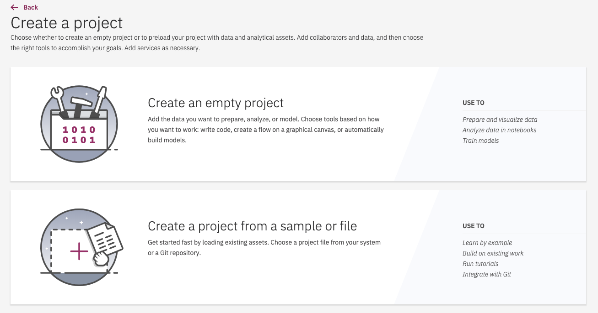
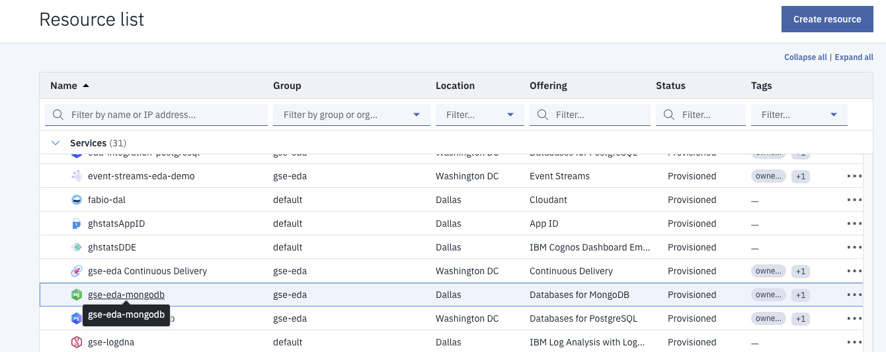
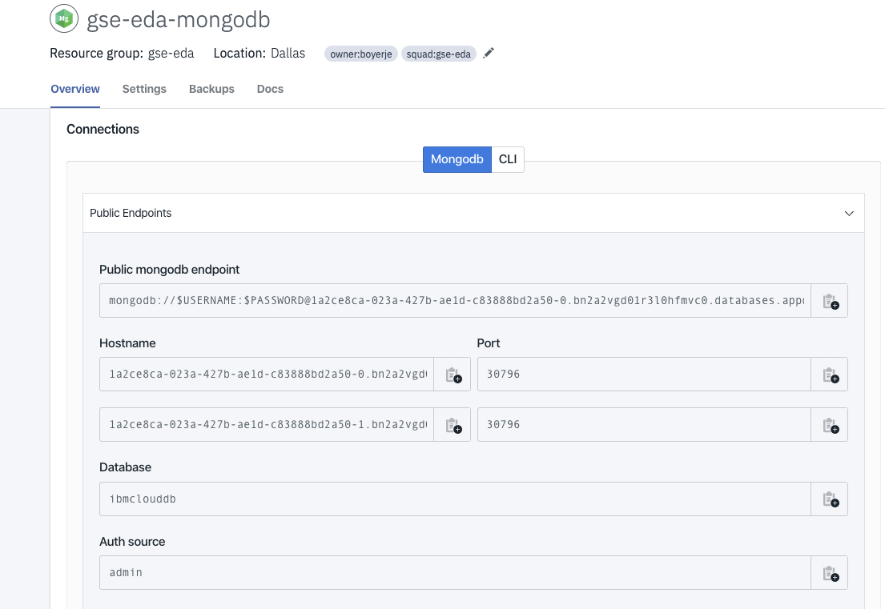

# IBM Cloud Pak for Data: data collection

To develop the anomaly predictive service we first need to access the data. We have two datasources in this example: the product information and the telemetries data coming from the different Reefer Containers. With the telemetries we should be able to assess anomaly. The Telemetries are saved to a noSQL database. We are using MongoDB on IBM Cloud.


## Create a new project

Once logged into Cloud Pak for Data, create a new project. From the main page select the project view: 


and then new project, and select `analytics`:


Select an empty project: 



Enter basic information about your project


The result is the access to the main project page:


Now we need to define data source...

## Data Virtualization

To do not copy or move the data, we can add `Data virtualization` to a remote data source. 
First we need to get the connection information for the MongoDB database. 

* Going to the IBM Cloud account, under the Services resource, select the mongo instance:



* get the information about the data connection.



* Then download the TLS certificate as pem file:

```shell
ibmcloud login -a https://cloud.ibm.com -u passcode -p <somecode-you-get-from-your-login>
# Define your resource group
ibmcloud target -g gse-eda
ibmcloud cdb deployment-cacert gse-eda-mongodb > certs/mongodbca.pem
```

Back to Cloud pak for data, an administrator may define connections as a reusable objects by entering the data sources information. The figure below illustrates the connection configuration to the Mongo DB running on IBM Cloud:


Once define a Data scientist use this connection in the Collect menu to define a new `Data virtualization` definition to discover the telemetries data.
