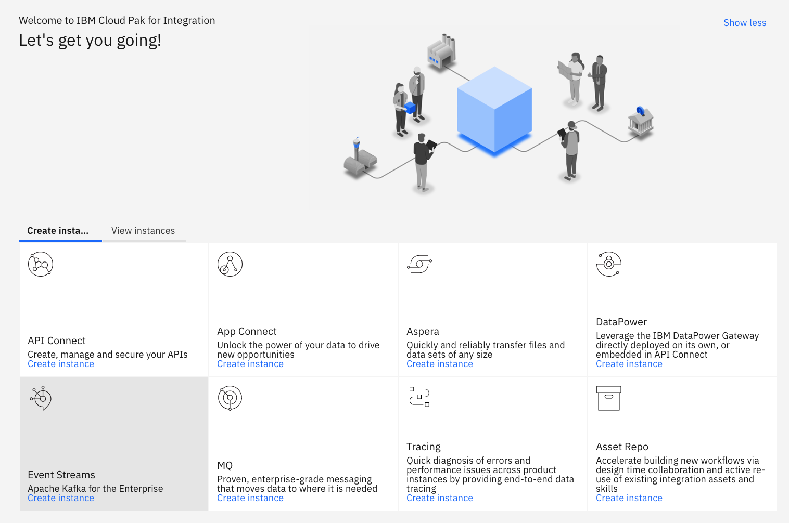
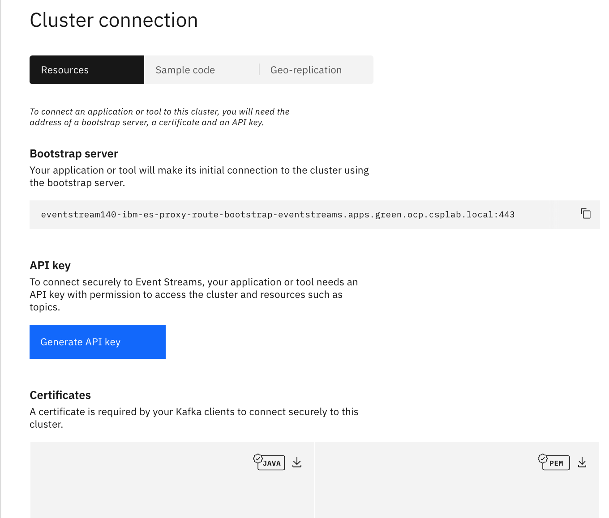
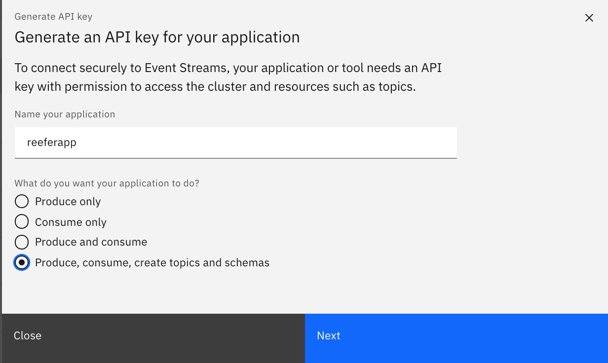
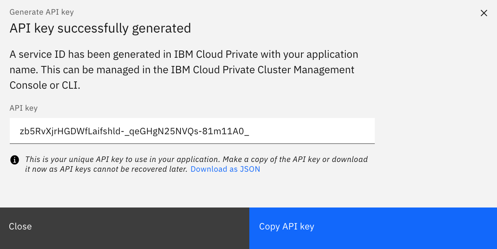
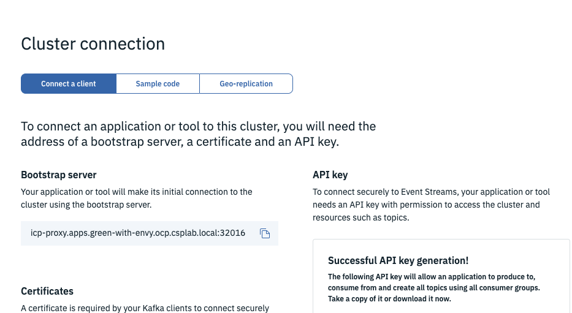
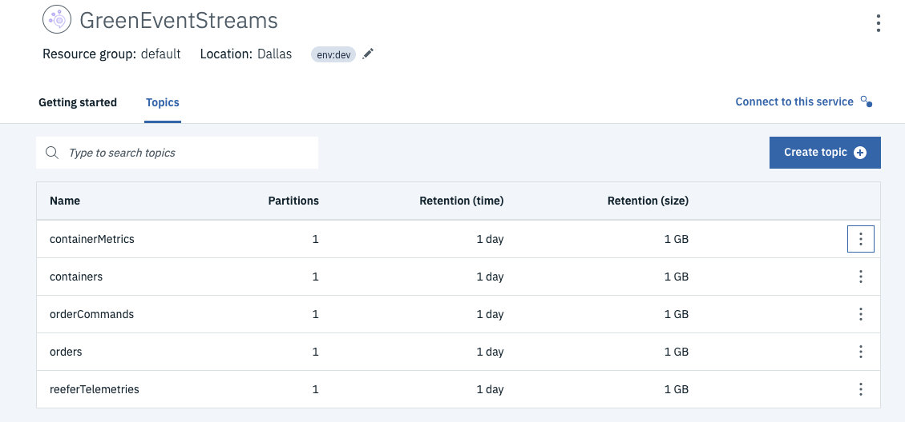
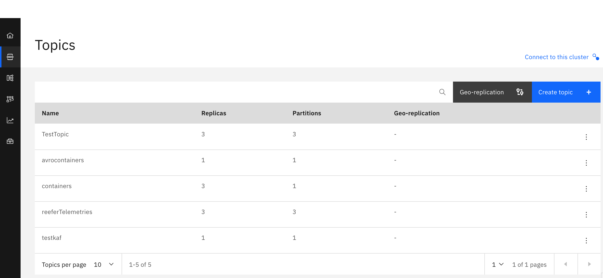

# Event Streams provisioning and configuration

We cover a lot about Kafka or IBM Event Streams installation and configuration in the [EDA reference architecture repository](https://ibm-cloud-architecture.github.io/refarch-eda/deployments/eventstreams/). In this short note we just highlight the steps to be done for deploying Event Streams on premise using Cloud Pak for integration.

## Deploying Event Streams from Cloud Pak for Integration

The [cloud pack for integration](https://www.ibm.com/cloud/cloud-pak-for-integration) includes IBM Event Streams, the Kafka solution for on premise deployment. 

Once you have an Openshift cluster, you can install cloud pak for integration as presented in [this tutorial](https://cloudpak8s.io/integration/onprem/#run-the-integration-cloud-pak-install). Then you can deploy Event streams with the default configuration of three broker cluster from the CP4I home page:




For your own deployment you can follow the steps described in [this tutorial](https://cloudpak8s.io/integration/deploy-kafka/) and the [Event Streams product documentation](https://ibm.github.io/event-streams/installing/installing-openshift/).

Once you have your instance up and running, you need to get the URL for the brokers, the API key to access topics and the TLS certificate.



Define the API key:





The copy the broker URL and api key in the `scripts/setenv.sh` file under the OCP choice:

```
OCP)
    export KAFKA_BROKERS=eventstream140-ibm-es-proxy-route-bootstrap-eventstreams.apps.green.ocp.csplab.local:443
    export KAFKA_APIKEY="zb5Rv-81m11A0_"
    export KAFKA_CERT="/project/useapp/simulator/certs/ocp/es-cert.pem"
```

And then download the pem and java key. We keep those files in the `certs/ocp` folder.

As an alternate you can use Event Streams on Public Cloud.


## Event Streams on IBM Cloud Public

We recommend creating the Event Stream service using the [IBM Cloud catalog](https://cloud.ibm.com/catalog/services/event-streams), you can also read our [quick article](https://ibm-cloud-architecture.github.io/refarch-eda/deployments/eventstreams/es-ibm-cloud/) on how to deploy Event Streams. 


With IBM Cloud deployment use the service credentials to create new credentials to get the Kafka brokers list, the admin URL and the api key needed to authenticate the consumers and the producers.

For Event Streams on Openshift deployment, click to the `connect to the cluster` button to get the broker URL and to generate the API key: select the option to generate the key for all topics.




## Defines topics

The following diagram illustrates the needed Kafka topics configured in IBM Cloud Event Stream service:



For the telemetries we are now using 3 replicas. This is an example of configuration for Event Streams on openshift on premise:



