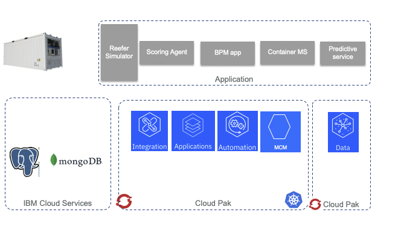
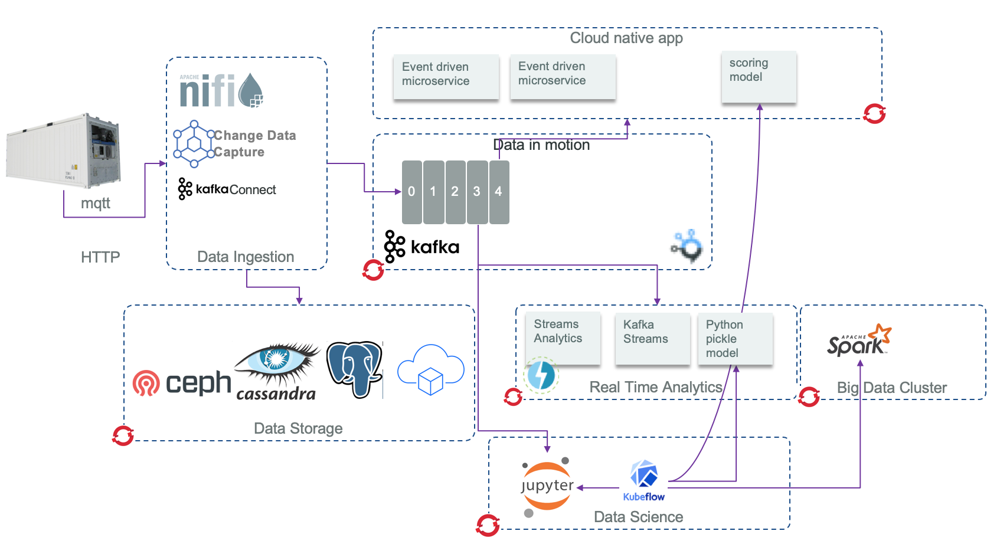

# Reefer Anomaly Detection Solution

This project is to demonstrate how to perform real time analytics, like anomaly detection for Reefer container in the shipping industry, using Reefer container telemetry event stream. 

!!! note
    This project is part of the [reference implementation solution](https://ibm-cloud-architecture.github.io/refarch-kc/)  to demonstrate the IBM [event driven reference architecture](https://ibm-cloud-architecture.github.io/refarch-eda) but it also presents how to combine different IBM cloud paks to build the solution: Cloud pak for data, for automation, for integration and for application.

As we will detail in next section there are four components in this solution that make the anomaly detection: a Reefer simulator (we do not have such Reefer container in our stock), a container microservice, an analytics scoring agent and a business process. The diagram below is a very high level view of the components in a three layer architecture with Openshift for the deployment infrastructure.




We also look at an open source version of this solution using an approach close to [opendatahub.io](http://opendatahub.io/) proposed architecture, as illustrated in the following diagram:



The Reefer container is an IoT device, which emits container telemetries every 10 minutes via the MQTT protocol. The first component receiving those messages is [Apache Nifi]() to transform the telemetry message to a kafka event. Kafka is used as the event backbone and event sourcing so microservices, deployed on Openshift, can consume and publish messages.

For persistence reason, we may leverage big data type of storage like Postgresql or Cassandra to persist the container's telemetry over a longer time period. This datasource is used by the Data Scientists to do its data preparation and build training and test sets and select the best model. We also illustrate how to connect to Kafka topic as data source, from a Jupyter notebook.

Data scientists can run Jupyter lab on OpenShift and build a model to be deployed as python microservice, consumer of Reefer telemetry events. When anomaly is detected, a new  event is posted to the `containers` topic so the Reefer container manager microservice can apply the expected business logic. 

## MVP component view

For a minimum viable demonstration the runtime components looks like in the figure below:


1. A web app, deployed on Openshift, is running a simulator to simulate the generation of Reefer container telemetries while the container is at sea or during end to end transportation. The app exposes a simple POST operation with a control object to control the simulation. Here is an example of such [control.json](https://github.com/ibm-cloud-architecture/refarch-reefer-ml/blob/master/scripts/simulControl.json) object

    ```json
    { 'containerID': 'C02',
    'simulation': 'co2sensor',
    'nb_of_records': 1000,
    "product_id":  "P02"
    }
    ```

    The simulation can be done on o2sensor, co2sensor or power. 

1. A curl script does the HTTP POST request of this json object. [See this paragraph.](#test-sending-a-simulation-control-to-the-post-api)
1. The telemetry events are sent to the `reeferTelemetries` topic in Kafka.
1. The predictive scoring is a consumer of such events, read one event at a time and call the model internally, then sends a new event when maintenance is required. [See the note](analyze/oss-ml-dev.md) for details.
1. The maintenance requirement is an event in the `containers` topic.
1. The 6th component of the solution, is the [container microservice](https://ibm-cloud-architecture.github.io/refarch-kc-container-ms/) which was defined in the EDA reference implementation.
1. The [maintenance engineer intervention process](infuse/bpm.md) is modeled in BPM, deploy on public cloud and the process application is exposed as API. The container identifier and the telemetry record is sent as input to the process.

## Pre-requisites to build and run this solution

Start by cloning this project using the command:

```
git clone https://github.com/ibm-cloud-architecture/refarch-reefer-ml
```

### Be sure to have Event Stream or a Kafka cluster running somewhere

We recommend creating the Event Stream service using the [IBM Cloud catalog](https://cloud.ibm.com/catalog/services/event-streams), you can also read our [quick article](https://ibm-cloud-architecture.github.io/refarch-eda/deployments/eventstreams/es-ibm-cloud/) on how to deploy event stream. 

*As an alternate approach, we have deployed Event Stream on Openshift running on-premise servers following the product documentation [here](https://ibm.github.io/event-streams/installing/installing-openshift/).* 

The following diagram illustrates the needed Kafka topics configured in IBM Cloud Event Stream service:


With IBM Cloud deployment use the service credentials to create new credentials to get the Kafka brokers list, the admin URL and the api key needed to authenticate the consumers and the producers.

For Event Streams on Openshift deployment, click to the `connect to the cluster` button to get the broker URL and to generate the API key: select the option to generate the key for all topics.


### Provision a Postgresql service

If you plan to use Postgresql as a data source instead of using csv file, then you need to provision a Postgresql service in IBM Cloud. Use the [product documentation](https://cloud.ibm.com/docs/services/databases-for-postgresql) to provision your own service. Define service credential and use the `composed` url, the database name and the SSL certificate. Use the following commands to get the certificate:
        
```shell
ibmcloud login
ibmcloud cdb cacert <database deployment name>
```  

Save this file as `postgres.pem` under the simulator folder.

### Set environment variables

As part of the [12 factors practice](https://12factor.net/), we externalize the end points configuration in environment variables. We are providing a script template (`scripts/setenv-tmp.sh`) to set those variables for your local development. Rename this file as `setenv.sh`. This file is git ignored, to do not share keys and passwords in public domain.

The variables help the different code in the solution to access the Event Stream broker cluster and the Postgresql service running on IBM Cloud.


### Building a python development environment as docker image

To avoid impacting our laptop environment (specially macbook which use python), we use a dockerfile to get the basic of python 3.7.x and the python modules like kafka, http requests, pandas, sklearn, pytest... we need to develop and test the different python code of this solution. To build your python image with all the needed libraries, use the following commands:

```
cd docker
docker build -f docker-python-tools -t ibmcase/python .
```

To use this python environment you can use the script: `startPythonEnv`. 

When running with Event Stream and Postgres on the cloud use  IBMCLOUD argument:

```
# refarch-reefer-ml project folder
./startPythonEnv.sh IBMCLOUD
```

### Build the docker image for Jupyter notebook

We are using a special version of conda to add the postgresql and kafka libraries for python so we can access postgresql or kafka from notebook. The Dockerfile may use a `cert.pem` file, which contains the postgres certificate so the notebook can connect to postgresql service with SSL connection. 

```
cd docker 
docker build -f docker-jupyter-tool -t ibmcase/jupyter .
```

To run this jupyter server use the startJupyterServer.sh script:

```
# refarch-reefer-ml project folder
./startJupyterServer.sh IBMCLOUD
```

### Create the postgresql database

If you use POSTGRESQL on IBM Cloud, you need to get the SSL certificate and put it as postgres.pem under the simulator folder, or set POSTGRES_SSL_PEM to the path where to find this file.

The postgres.pem file needs to be in the simulator folder.

Run the [ReeferRepository.py]() tool to create the database schema and to add some reference data like the product catalog:

```
./startPythonEnv.sh IBMCLOUD
> python simulator/infrastructure/ReeferRepository.py
```

You should see the following trace:

```
Connect remote with ssl
('PostgreSQL 10.10 on x86_64-pc-linux-gnu, compiled by gcc (Debian 6.3.0-18+deb9u1) 6.3.0 20170516, 64-bit',)
[
    {
        "container_id": "C01",
        "last_maintenance_date": null,
        "reefer_model": "20RF"
    },
    {
        "container_id": "C02",
        "last_maintenance_date": null,
        "reefer_model": "20RF"
    },
    {
        "container_id": "C03",
        "last_maintenance_date": null,
        "reefer_model": "40RH"
    },
    {
        "container_id": "C04",
        "last_maintenance_date": null,
        "reefer_model": "45RW"
    }
]
[
    {
        "content_type": 1,
        "description": "Carrots",
        "product_id": "P01",
        "target_humidity_level": 0.4,
        "target_temperature": 4.0
    },
    {
        "content_type": 2,
        "description": "Banana",
        "product_id": "P02",
        "target_humidity_level": 0.6,
        "target_temperature": 6.0
    },
    {
        "content_type": 1,
        "description": "Salad",
        "product_id": "P03",
        "target_humidity_level": 0.4,
        "target_temperature": 4.0
    },
    {
        "content_type": 2,
        "description": "Avocado",
        "product_id": "P04",
        "target_humidity_level": 0.4,
        "target_temperature": 6.0
    }
]
('public', 'reefers', 'ibm-cloud-base-user', None, True, False, True, False)
('public', 'products', 'ibm-cloud-base-user', None, True, False, True, False)
('public', 'reefer_telemetries', 'ibm-cloud-base-user', None, True, False, True, False)
```

## Project approach

The solution covers different development areas and practices: event driven microservice, business process, data ops and machine learning model development. The software life cycle integrate the three main tracks of DevOps, DataOps and MLOps as presented in [this methodology article](https://ibm-cloud-architecture.github.io/refarch-data-ai-analytics/methodology/).

### DevOps

As all the services developed in this solution are event-driven we do not need to rephrase how we used event storming and applied the different patterns for each microservices. You can read the following articles to learn more:

* [Event storming workshop](https://ibm-cloud-architecture.github.io/refarch-eda/methodology/eventstorming/)
* [From analysis to microservice using domain driven design](https://ibm-cloud-architecture.github.io/refarch-kc/design/readme/)
* [Apply DDD to order microservice](https://ibm-cloud-architecture.github.io/refarch-kc-order-ms/ddd-applied/)
* [Apply DDD to the container management microservice](https://ibm-cloud-architecture.github.io/refarch-kc-container-ms/ES2DDD2MS/)

For the adoption of Appsody and CI/CD based on tektron, we present how we use Cloud Pak for application in the development of the scoring microservice in [this note](infuse/dev-scoring.md).

To understand how to deploy each service on openshift see [this detailed note](infuse/build-run.md).

### DataOps

[Collect data with open source approach](collect/oss-collect-data.md).

[Collect data with cloud pak for data](collect/cp4d-collect-data.md).

### MLOps

To use Jupyter, Sparks and kubeflow see [this note](analyze/oss-ml-dev.md)

## Further Readings

* [Romeo Kienzler anomaly detection article 1](https://developer.ibm.com/tutorials/iot-deep-learning-anomaly-detection-1)
* [Romeo Kienzler anomaly detection article 2](https://developer.ibm.com/tutorials/iot-deep-learning-anomaly-detection-2)
* [Romeo Kienzler anomaly detection article 3](https://developer.ibm.com/tutorials/iot-deep-learning-anomaly-detection-3/)